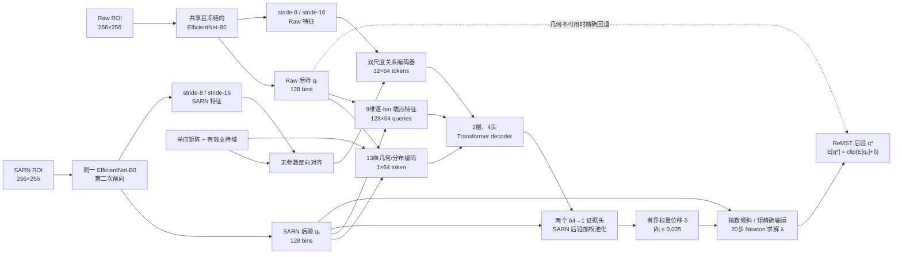

# ReMST：Relation-Encoded Moment-Exact Scalar Transport

## 发表名称与兼容名称

正式模型名称为 **ReMST**，全称 **Relation-Encoded Moment-Exact Scalar
Transport**，中文可写作“关系编码矩精确标量输运网络”。论文图表统一使用
**ReMST (ours)**。

`direct_scalar` 只是实验阶段的消融标识，`A15.2-METT` 是其来源架构族。为了让已经完成的
checkpoint、命令行和 JSON 能继续逐项回放，仓库不改写这两个机器标识；新生成的训练与评测
产物会额外写入 `publication_model`，并将人类可读标签显示为 ReMST。

| 用途 | 名称 |
|---|---|
| 论文正文、表格、图例 | ReMST (ours) |
| 英文全称 | Relation-Encoded Moment-Exact Scalar Transport |
| 中文名称 | 关系编码矩精确标量输运网络 |
| 旧实验变体键 | `direct_scalar` |
| 旧逐行候选键 | `mett` |
| 来源架构族 | A15.2-METT |

## 总体架构

ReMST 是一个连续的、后验值域的回归模型，不是从 Raw、SARN 或多个专家中做样本级
N 选一路由。Raw 与 SARN 是同一冻结锚点的两个观测；可用几何关系只决定关系校正是否有
定义，不依据预测好坏选择专家。



## 模块与张量规格

| 阶段 | 实现 | 输出规格 | 可训练参数 |
|---|---|---:|---:|
| 共享锚点 | ImageNet 初始化后在 SyncG 上训练 30 epoch 的 EfficientNet-B0；ReMST 阶段冻结 | 1280维表示、stride-8 的 40通道特征、stride-16 的 112通道特征 | 0（冻结） |
| 矩精确后验提升 | 将标量读数提升为固定尺度的 128-bin 后验，并用 Newton 法精确匹配锚点标量均值 | `qᵣ,qₛ ∈ Δ¹²⁷` | 0（ReMST 阶段冻结） |
| 双尺度关系编码 | 每尺度共享 `1×1 Conv → GN → SiLU` 投影到 48通道；拼接两视图、差、绝对差、乘积、余弦和支持掩码，共 242通道 | 每尺度 `4×4×64`，合计 32 个 token | 50,848 |
| 几何 token | 8个归一化单应参数 + 2个支持面积 + 均值差、对数方差比、JS 散度 | `1×64` token | 5,146 |
| 逐-bin 解码器 | 每个 bin 使用 `qᵣ,qₛ,log qᵣ,log qₛ,CDFᵣ,CDFₛ,Δq,ΔCDF,x` 九维特征；2层、4头、FFN宽度128、dropout 0 | `128×64` token | 113,600 |
| 标量输运桥 | 两个共享解码 token 上的 `64→1` 证据头，在 `qₛ` 下池化为一个标量 | 一个样本级位移 `δ` | 130 |
| 合计校正器 | 关系编码 + 几何 token + Transformer + 输运桥 | 128-bin 后验 | **169,724** |

冻结锚点有 4,010,110 个参数；锚点在两个视图上复用同一组权重，因此只计一次。ReMST
总唯一参数为 **4,179,834**，其中 **169,724** 个可训练参数，占 4.06%。几何对齐器没有
可训练参数。

## 核心计算

令固定进度网格为 `x_k = k/(K-1)`，`K=128`。冻结锚点分别给出 Raw 后验
`qᵣ(k)` 与 SARN 后验 `qₛ(k)`。关系解码器生成逐-bin 表征 `z_k∈R⁶⁴`，两个线性证据头
输出 `a_k` 和 `b_k`。ReMST 先在 SARN 后验下池化：

```text
s = 1/2 · [Σ_k qₛ(k)a_k + Σ_k qₛ(k)b_k]
δ = 0.25 · 0.1 · tanh(s)
μ* = clip(Σ_k qₛ(k)x_k + δ, ε, 1-ε)
```

因此最大进度位移为 `0.025`。接着求解唯一的自然参数 `λ`：

```text
q*(k; λ) = qₛ(k) exp(λx_k) / Σ_j qₛ(j) exp(λx_j)
Σ_k q*(k; λ)x_k = μ*
```

实现使用 20 次 Newton 更新。该步骤不是把两个预测做加权平均，而是在尽可能保留 SARN
后验形状的同时，只沿其指数族的一阶矩方向移动。训练时保留 8 个自然参数路径节点用于路径
损失；推理输出最后的 `q*`。

## 可用性边界与不确定性表述

- SARN 激活、单应矩阵有效且 stride-8/16 对齐支持均非空时，执行关系编码与矩输运。
- 任一条件不成立时，模型在最外层边界精确返回 Raw 后验；这是几何运算是否有定义的确定性
  边界，不是根据预测置信度选择专家。
- 位移为零时精确返回 SARN 端点，避免 Newton 浮点余量改变零初始化语义。
- 后验尺度在 ReMST 校正训练中固定为 `0.025`，所以 CRPS、覆盖率和 PIT 只能表述为固定尺度
  后验诊断，不能宣称为学习得到或已经校准的不确定性。

## 训练与论文描述

锚点全程冻结，仅训练 169,724 参数的校正器；正式配置训练 5 epoch，AdamW，学习率
`3×10⁻⁴`、权重衰减 `1×10⁻⁴`，使用余弦退火。三个正式拟合分别使用独立初始化和样本顺序
种子，测试时不训练、不适配、不做跨种子集成。

可直接用于英文 Methods 的一句话描述：

> ReMST applies a shared frozen EfficientNet-B0 to raw and support-normalized
> views, decodes homography-aligned dual-scale relations into a bounded scalar
> progress displacement, and realizes that displacement as an exact first-moment
> exponential tilt of the endpoint posterior.
