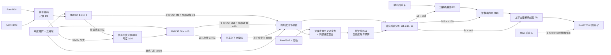

# ReMSTNet：自适应分层关系—矩输运网络

## 设计目标

ReMSTNet 不采用“完整通用分类主干 + 末端校正头”的执行结构。Raw 与 SARN 从输入端就是一对
联合观测；共享编码干线在尺度 1/8 和 1/16 被两个原生 **ReMST Block** 中断。每个 Block
产生关系记忆并把有界残差写回特征流，因此第二阶段看到第一阶段已经关系化的表征。

v1 的两个局部矩头会学习相反方向的平均位移。v2/v3 改为跨尺度协调：网络只预测一个总矩
位移，再用非负单纯形权重分配给两个 Block 和上下文阶段，从结构上消除阶段抵消。v3 进一步
加入局部进度混合与可学习的有界预算增益。

正式架构标识为：

```text
ReMSTNet-Adaptive-Budget-Progress-Mixing-Relation-Moment-Backbone-v3
```

## 架构图



架构图不依赖任何外部分类网络名称。实现仍如实记录权重来源：共享卷积阶段由已有 30-epoch
标量读数 checkpoint 初始化，随后保存在自包含 ReMSTNet checkpoint 中。该来源属于权重
provenance，不定义新网络的前向拓扑。

## ReMST Block

对尺度 `l∈{8,16}`，输入为 Raw 特征 `Fᵣˡ`、几何对齐后的 SARN 特征 `Fₛˡ` 和支持域
`Mˡ`。关系张量为：

```text
R_l = [P(Fᵣˡ), P(Fₛˡ), ΔF, |ΔF|,
       P(Fᵣˡ)⊙P(Fₛˡ), cosine, Mˡ]
```

共享关系投影宽度为 48，关系 token 宽度为 64。Block 同时产生空间关系记忆、局部矩证据
和有界特征回写：

```text
Fᵣˡ′ = Fᵣˡ + 0.1 · tanh(Conv(R_l)) · Mˡ
(M_l, e_l) = RelationEncode(R_l)
```

`Fᵣˡ′` 进入下一编码尺度，因此关系建模改变后续特征计算，而不是仅作用于最终标量。

## 跨尺度矩协调与自适应预算

协调器把两个尺度的关系记忆、显式几何 token、上下文变化 token 组成联合记忆。每个进度 bin
使用 Raw/SARN 概率、对数概率、CDF、差分和归一化位置构造九维查询，经多头交叉注意力读取
联合记忆；随后使用 kernel-5 depthwise 进度混合交换相邻刻度信息，不运行通用的全 bin
self-attention。

总位移和预算增益为：

```text
g = 1 + 0.5 · tanh(ρ),                 0.5 < g < 1.5
Δ = 0.025 · g · tanh(e_progress + mean(tanh(e8), tanh(e16), tanh(ec)))
α = softmax([tanh(e8), tanh(e16), tanh(ec)])
δ8 = α8Δ,  δ16 = α16Δ,  δc = αcΔ
```

因此三个阶段位移逐样本同号、和严格等于 `Δ`，不会重现 v1 的正负抵消。零初始化时
`Δ=0`，有效样本精确等于 SARN 端点；关系无定义时精确等于 Raw 后验。

每一步通过 20 次 Newton 更新完成离散 KL 信息投影：

```text
q_{l+1} = argmin_q KL(q || q_l)
          subject to E_q[x] = E_{q_l}[x] + δ_l
```

三次投影使用同一个一阶矩充分统计量，所以最终标量由总位移 `Δ` 决定；阶段分解用于连接
分层关系证据、输出可检查的中间后验和保证无抵消，不声称凭重复投影扩大标量函数类。

## 参数分解

| 模型 | 可训练参数 | 总唯一参数 |
|---|---:|---:|
| 上一版 ReMST | 169,724 | 4,179,834 |
| ReMSTNet-v1 | 58,810 | 4,068,920 |
| ReMSTNet-v2（跨尺度协调） | 252,183 | 4,262,293 |
| **ReMSTNet-v3（自适应预算 + 进度混合）** | **261,528** | **4,271,638** |

v3 的具体组成是：共享基础编码 4,010,110，Block-8 为 25,337，Block-16 为 33,473，
跨尺度矩协调器为 202,718。训练期间共享基础编码与读数投影冻结并逐张量验证不变。

## 论文实验编排依据

这里不把内部版本演进当作主 PK。参考 Electronics 的指针仪表与轻量视觉论文，主结果应先与
外部方法比较，再单独用消融回答所提模块的贡献：

- [PriKMet](https://www.mdpi.com/2079-9292/14/16/3194) 分开报告外部方法、推理效率以及
  检测/校正和 backbone 消融；
- [TransUNet 指针仪表方法](https://www.mdpi.com/2079-9292/13/13/2436) 以跨方法精度、误差和
  分阶段耗时为主要对比；
- [改进 LinkNet 指针仪表方法](https://pmc.ncbi.nlm.nih.gov/articles/PMC11487445/) 使用模块开关
  表，并同时报告参数量、FLOPs 和 FPS；
- [ELS-YOLO](https://www.mdpi.com/2079-9292/14/19/3877) 也用组合消融验证模块贡献与效率平衡。

据此，ReMSTNet 的主表是三种子外部模型比较；内部表只做“进度混合 × 自适应矩预算”的
`2×2` 配对消融。v1→v2 只保留为架构发展记录，不增加多种子训练，也不作为论文主消融或
“击败外部模型”的证据。

## 三种子外部模型主结果（2026-08-18）

三个 source seed 为 `20262020/20262021/20262022`，每个模型使用独立初始化和样本顺序，
训练 5 个固定终轮 epoch。所有方法使用同一 1,558 样本、14 scene、六条件清单，每个种子
9,348 行；表中是独立训练的均值 ± 样本标准差，不是多模型预测融合。

| 方法 | 全条件 NMAE | 透视三条件 NMAE |
|---|---:|---:|
| **ReMSTNet-v3** | **0.010704 ± 0.000373** | **0.013259 ± 0.000391** |
| SARN-v2 + Direct-ResNet18 | 0.014832 ± 0.000346 | 0.021648 ± 0.000435 |
| SARN-v2 + EfficientNet-B0 | 0.013935 ± 0.000606 | 0.019722 ± 0.000852 |
| SARN-v2 + MobileNetV3-Large | 0.016335 ± 0.000716 | 0.023143 ± 0.001361 |

相对三个外部模型，ReMSTNet-v3 的全条件相对 NMAE 分别降低 27.83%、23.19% 和 34.47%；
透视三条件分别降低 38.75%、32.77% 和 42.71%。按完整 scene 配对重采样 20,000 次后，
全条件差值 95% CI 分别为 `[-0.004604, -0.003665]`、
`[-0.003522, -0.002896]`、`[-0.006455, -0.004768]`，三项均严格低于零。

三个 source seed 的内部 SARN 端点与外部 B0 同种子账本均完成 9,348 行数值回放，最大预测
差分别为 `3.327e-4`、`1.774e-4`、`2.355e-4`，全部低于预先使用的 `5e-4` 配对容差。
对应正式产物为：

```text
C:\pointer_read\sgca_multiview_pilot_v1\remstnet_v3_multiseed_external_comparison_replay_verified.json
```

## 论文主消融：进度混合 × 自适应矩预算

消融固定 source seed `20262022`、初始化种子 `20262215`、样本顺序种子 `20262219`、5 个
epoch、相同训练顺序和 9,348 行评测清单。四臂只切换两个机制，不改变其他网络宽度或训练
设置。

| 进度混合 | 自适应预算 | 可训练参数 | 全条件 NMAE | 透视三条件 NMAE |
|---:|---:|---:|---:|---:|
| 否 | 否 | 252,183 | 0.010800 | 0.013858 |
| 是 | 否 | 261,527 | 0.010682 | 0.013623 |
| 否 | 是 | 252,184 | 0.011067 | 0.014394 |
| **是** | **是** | **261,528** | **0.010276** | **0.012811** |

这个结果不支持“两个模块各自独立提升”的简单包装：

- 固定预算下加入进度混合，全条件 `ΔNMAE=-0.000118`，95% CI
  `[-0.000181, -0.000064]`；
- 没有进度混合时加入自适应预算反而变差，`ΔNMAE=+0.000268`，95% CI
  `[+0.000220, +0.000317]`；
- 已有进度混合时再加入自适应预算，`ΔNMAE=-0.000406`，95% CI
  `[-0.000489, -0.000321]`；
- 二者交互项为 `-0.000674`，95% CI `[-0.000792, -0.000550]`；透视子集交互项进一步扩大
  到 `-0.001348`。

因此可发表的机制结论是：**局部进度混合先把相邻刻度的关系证据组织成可用的进度场，
自适应预算再按该证据调节允许的一阶矩输运幅度；预算增益依赖进度结构，二者存在显著协同，
不是两个可任意叠加的小组件。** 正式产物为：

```text
C:\pointer_read\sgca_multiview_pilot_v1\remstnet_v3_factorial_mechanism_ablation_summary.json
```

## 四个真实域三种子冻结外测

四域均使用相同 source seed 的 `SARN-v2 + EfficientNet-B0` 作配对外部比较；测试时不训练、
不适配、不路由。每个域的六条件结果如下：

| 真实域 | ReMSTNet-v3 NMAE | 外部 B0 NMAE | 配对 Δ | 组级 95% CI | 结论 |
|---|---:|---:|---:|---:|---|
| field_gauge_roi_test_a | 0.116689 ± 0.012464 | 0.116963 ± 0.012283 | −0.000275 | [−0.000438, −0.000116] | 显著改善 |
| field_gauge_roi_test_b | 0.112915 ± 0.015050 | 0.113247 ± 0.014806 | −0.000332 | [−0.000487, −0.000177] | 显著改善 |
| field_gauge_external_roi | 0.201162 ± 0.057755 | 0.201135 ± 0.057342 | +0.000027 | [−0.000106, +0.000155] | 统计持平 |
| RF100 | 0.050289 ± 0.015948 | 0.051548 ± 0.015739 | −0.001259 | [−0.001893, −0.000530] | 显著改善 |

clean 条件下 ReMSTNet 与同源外部端点达到数值等价，验证无关系扰动时的结构性保底；最难的
外部 ROI 域没有可证实的增益，也没有可证实的退化。正式汇总为：

```text
C:\pointer_read\sgca_multiview_pilot_v1\remstnet_v3_real_domains_multiseed_summary.json
```

## 18 条件压力评测

seed `20262022` 在 1,558 个样本上执行 clean 与五个退化族共 18 条件，合计 28,044 行；每个
退化条件都重新生成 SARN，不复用图像或预测。透视连续曲线为：

| 条件 | Raw NMAE | SARN 端点 NMAE | ReMSTNet-v3 NMAE | 关系可用率 |
|---|---:|---:|---:|---:|
| clean | 0.007738 | 0.007738 | 0.007738 | 0.0% |
| perspective 15° | 0.012094 | 0.010437 | **0.009111** | 95.0% |
| perspective 30° | 0.019283 | 0.015121 | **0.010092** | 96.4% |
| perspective 45° | 0.041001 | 0.019950 | **0.012521** | 96.1% |
| perspective 60° | 0.141743 | 0.141743 | 0.141743 | 0.0% |

0–60° 归一化 NMAE AUC 为：ReMSTNet-v3 `0.026616`、SARN 端点 `0.030062`、Raw
`0.036780`，ReMSTNet-v3 分别降低 11.46% 和 27.63%。60° 时 SARN 关系不可定义，三个输出
一致回退；sensor noise、brightness、JPEG 和嵌套遮挡族也未触发关系修正，因此这些族的
ReMSTNet 输出与 Raw 完全相同。该结果证明的是“在定义域内改善并在定义域外保守回退”，
而不是对所有图像退化均有额外学习鲁棒性。正式产物为：

```text
C:\pointer_read\sgca_multiview_pilot_v1\remstnet_v3_seed20262022_stress_sweep.json
```

## 自然重复稳定性

自然重复协议包含 1,203 张图、86 个完整重复单元和 31 个物理仪表组。三个模型种子的覆盖率
均为 100%；ReMSTNet-v3 的三种子 full-denominator NMAE 为
`0.115867 ± 0.017559`，平均单元内总体标准差为 `0.040791 ± 0.003272`，平均单元内范围为
`0.143147 ± 0.013271`。因为该协议是 clean 条件，ReMSTNet、SARN 端点和 Raw anchor 三组
数值完全一致，所有配对差值和 20,000 次物理组 bootstrap CI 都为零。该实验只能主张
“clean 重复稳定性不被破坏”，不能主张 ReMSTNet 提升了 clean 重复性。正式产物为：

```text
C:\pointer_read\sgca_multiview_pilot_v1\remstnet_v3_natural_repeat_stability.json
```

## CUDA/BF16 效率

RTX 4060 上，每个 arm 在独立进程中使用固定 8 张 `perspective_severe` 图，B1/B8 各做 20 次
warmup 和 100 次计时。SARN 物化在计时区外，但所需 H2D 和全部实际 forward 均在计时区内。

| Arm | 唯一参数 | 本阶段可训练 | B1 mean/P50/P95 ms | B8 每样本 ms | B8 samples/s | B1/B8 峰值 MiB |
|---|---:|---:|---:|---:|---:|---:|
| Raw foundation | 4.010M | 0 | 7.973 / 7.834 / 9.635 | 1.123 | 890.82 | 30.9 / 81.7 |
| Raw + SARN twin endpoint | 4.010M | 0 | 14.551 / 14.506 / 15.142 | 2.118 | 472.25 | 31.8 / 88.7 |
| **ReMSTNet-v3** | **4.272M** | **0.262M** | **30.640 / 30.596 / 31.969** | **4.138** | **241.67** | **34.2 / 94.9** |

完整网络相对双端点增加约 6.52% 唯一参数，B1 延迟增加约 16.09 ms；在 B1 下仍达到
32.64 samples/s。未报告 FLOPs：自定义矩精确求解和 grid sampling 不能被当前 dispatcher
计数器完整覆盖，发布不应把部分 FLOPs 冒充全模型 FLOPs。三个正式 JSON/Markdown 位于：

```text
C:\pointer_read\sgca_multiview_pilot_v1\remstnet_v3_efficiency_raw_foundation.{json,md}
C:\pointer_read\sgca_multiview_pilot_v1\remstnet_v3_efficiency_twin_endpoint.{json,md}
C:\pointer_read\sgca_multiview_pilot_v1\remstnet_v3_efficiency_full_remstnet.{json,md}
```

## 结构边界与主张限制

- 两个 Block 都有效时才输出关系输运结果；SARN 未激活、单应无效或任一尺度支持域为空时，
  精确返回 Raw 后验。
- 回退只由关系运算是否有定义决定，不依赖预测置信度、目标值或多个专家的相对优劣。
- 固定后验尺度只用于敏感性诊断，不能表述为学习得到或经过校准的不确定性。
- SyncG 上可以主张三种子显著超过三个外部模型；真实域应逐域陈述“三域改善、一域持平”，
  不能写成所有域全面领先。
- v1→v2 不进入论文主消融；论文主消融只归因 v3 声称的进度混合和自适应预算协同。
